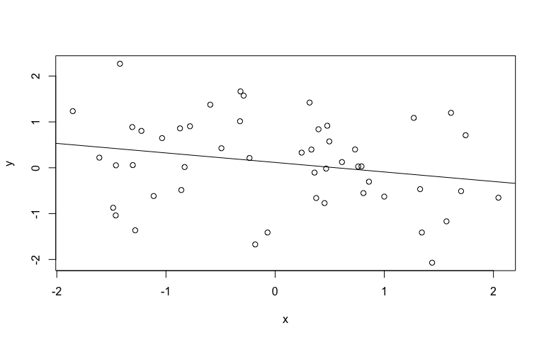

Python-Knitr Guide
================
Marni Tausen
21/03/2017 - 14:09:42

-   [Installation](#installation)
-   [Introduction](#introduction)
-   [Functions](#functions)
    -   [Example](#example)
    -   [Linear regression](#linear-regression)
-   [Inject](#inject)
-   [Compiling](#compiling)
-   [Extra functions](#extra-functions)

Installation
------------

To install the package, download the repository and run the setup.py command in the follow in style:

    python setup.py install

For it to work, it assumes you have R installed. There are some dependencies aswell that need to be installed. Here is a list of the dependencies:

-   knitr (<https://yihui.name/knitr/>)
-   rmarkdown (<http://rmarkdown.rstudio.com>)
-   pandoc (<http://pandoc.org>)

If Rstudio is installed, then most of these dependencies are included. Currently only supports python 2.7.

Introduction
------------

Python-Knitr is a wrapper that produces an R markdown document, by loading R scripts or python scripts, and sets up the document for you and compiles it.

The basic syntax of how to load the package is as follows, and then you initialize a document by creating a Knitr object.

``` python
from PythonKnitr import Knitr

document = Knitr()
```

The Knitr() class, can take in 2 parameters title and author. If these two parameters are included it will make a title text at the top.

Functions
---------

The Knitr object has a set of built-in functions which allows you to add text or scripts to the markdown document in different ways. The most simple function is the .text() function, which simply adds text into the document. An example usage shown below:

``` python
document.text('This is an example', title='Example', level=3)
```

This would produce the following result:

------------------------------------------------------------------------

### Example

This is an example

------------------------------------------------------------------------

.text() only has 3 parameters, body (which is required, and the text you are going to add), title, and level. Title is optional and always produces a new section and level is what sets the size of the header, default is 2. The parameter title is included with the other two core functions, .analysis() and .figure().

The second feature is including an analysis with .analysis()

``` python
document.analysis('''
x <- rnorm(50)
y <- rnorm(50, mean=x)
summary(lm(y ~ x))
''', title="Linear regression",
description="Linear regression produced by randomly generated data from rnorm",
language="R", display=True, echo=True, level=3)
```

This would produce the following result:

------------------------------------------------------------------------

### Linear regression

Linear regression produced by randomly generated data from rnorm

``` r
x <- rnorm(50)
y <- rnorm(50)
summary(lm(y ~ x))
```


    Call:
    lm(formula = y ~ x)

    Residuals:
         Min       1Q   Median       3Q      Max 
    -1.88478 -0.52608  0.06003  0.61189  1.85794 

    Coefficients:
                Estimate Std. Error t value Pr(>|t|)
    (Intercept)   0.1146     0.1330   0.862    0.393
    x            -0.2081     0.1260  -1.651    0.105

    Residual standard error: 0.9404 on 48 degrees of freedom
    Multiple R-squared:  0.05372,   Adjusted R-squared:  0.03401 
    F-statistic: 2.725 on 1 and 48 DF,  p-value: 0.1053

------------------------------------------------------------------------

.analysis() has many parameters, that can be specified. The first and only required parameter is script. This can either be straight code as shown above, or a file with the extension .R or .r. The function by default assumes that the code given is R code. However python code can also be included, by including a file with the extension .py, or by changing the parameter language, and changing it to 'python'. Second it also contains the title, parameter, which produces a new section with the given input. The third parameter is 'description', which allows you to write body text above the analysis outputs.

Next parameter is language, which was described earlier. By default it says 'R', but you can change it python for it to interpret python code instead. Next is display, which is a boolean parameter, which says whether the output from the script should be displayed or not. Finally the last parameter is echo, which tells the program whether or not code it self should be shown.

The third function is .figure(), which is specifically designed to include figures. .analysis() will also output figures, but does not contain parameters to control the aesthetics of the figures. Figure allows you to add an image file, or you can include an R script which produces a figure.

``` python
document.figure('''
reg <- coef(lm(y ~ x))
plot(x, y)
abline(reg[1], reg[2])
''', description = "Plot of the linear regression between variables x and y.",
width=9, height=5)
```

This would produce the following result:

------------------------------------------------------------------------

Plot of the linear regression between variables x and y. 

------------------------------------------------------------------------

.figure() has the same parameters as .analysis(), but also includes variables for modifying the size of the image, width and height, which are self explanatory.

Inject
------

There is another type of function, where you can 'inject' a python script from the main script you are working in, into the document. So you can write a python code, and whatever result you want to display you can inject. Example

``` python
a = 65
b = 15

document.inject("print a+b", globals(), echo=True)
```

This would produce the following result:

------------------------------------------------------------------------

``` python
print a+b
```

    80

------------------------------------------------------------------------

This allows for quick display of results from a python script into the Markdown document. Code given to the function, is executed as is, so anything given to it will run like it would in the script. So for anything to be displayed, the code explicitly needs to print stuff. There is also a mandatory parameter called globals(), which is necessary if you want to access any of namespace in python, from within the class. (If possible, in future I would like to remove this) Next there are the optional parameters, which are the same as for .figure(), .analysis(), where you can write a title, description, and choose the level of the header. Finally there is the echo boolean parameter, where you can specify where the code itself should be displayed or not.

Compiling
---------

When the script is document is done, you want to produce the document. For that you use the .compile() function. This will result in the Markdown document, being saved, and compiled into the desired format. Example:

``` python
document.compile("README.Rmd", output_type="github")
```

This would result in a github markdown document being made, with an addition of a preview html. There are multiple output\_types which can be chosen from. Here is a list of all the types.

-   html
-   github
-   word
-   md
-   pdf

Extra functions
---------------

There are a functions, which the other functions call specifically 'makecodeblock' and 'save\_file'. save\_file is very straight forward in that it saves the content generated into a markdown file. However it does not compile or run any of the code included.

Makecodeblock, is the core function that all of the other scripts use. Here you have direct access to how the code chunk from Rmarkdown documents is made. Here are all of the parameters the function has, and the default settings.

``` python
makecodeblock(script, lang, echo=False, width=8, height=5, results="show",
              include=True, eval=True)
```

Most of these are straight forward, but if you want to show code, without it being run, as with this document you can set eval=False.

The last function is 'set\_options'. This sets the general options for the document and how the code blocks in the document should be displayed. Here are the parameters and their default settings.

``` python
set_options(comment="##", warning=True, error=True,
            message=True, highlight=True, background="#FFFFFF", size="normalsize",
            seed=False, seed_num=100)
```

Here is a list of the parameters, and an explanation of what the do. Note, that these parameter only apply for cases where R code is used.

-   comment (What kind of symbol or text should be appended in front of each line in the output. Standard default. However for this document is option was set to comment='')
-   warning (Whether to display warnings produced by functions. If set to False, then warnings are found on the compilation text instead on the document)
-   error (Whether to display error messages on the document. If set to False, then error messages are shown on the compilation text instead)
-   message (Whether to display messages from functions on the document. If set to False then messages are shown on the compilation text instead)
-   highlight (Whether code should be syntax highlighted or not)
-   background (The background color of the code areas. Default is white.)
-   size (The text size of code areas. Uses the size names from latex, which are: tiny, scriptsize, footnotesize, small, normalsize, large, Large, huge, Huge. From smallest to largest)
-   seed (A boolean whether a seed should be set in the document. This is for cases where randomness is included in the script, and to fix the results you can set a seed. Note this should usually only be done if you have illustrative examples.)
-   seed\_num (The specfic seed number which is set.)

Note: This document itself was generated using this tool. See README.py to see how this was written.
